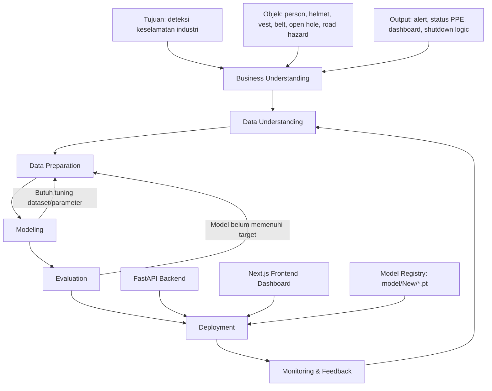
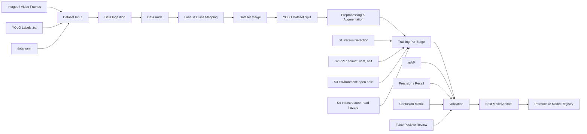
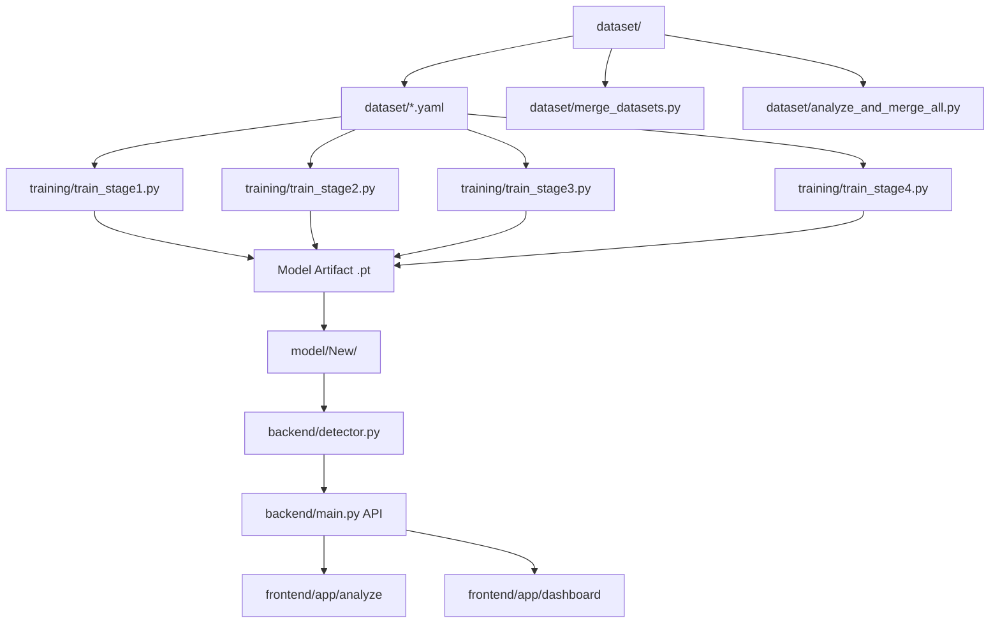
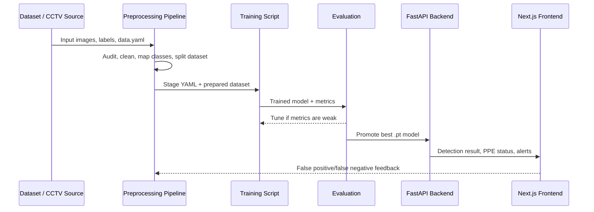

# SIEWS+ CRISP-DM Architecture Flow

Dokumen ini menjelaskan alur awal pengembangan model SIEWS+ berbasis CRISP-DM, terutama dari input dataset, preprocessing, training, evaluasi, sampai model siap dipakai oleh backend.

## 1. Flow Besar CRISP-DM

## 2. Flow Dataset Sampai Training

## 3. Detail Tahapan

### Business Understanding

Fase ini menentukan kebutuhan sistem sebelum dataset diproses.

- Sistem harus mendeteksi pekerja/person.
- Sistem harus memberi status PPE per person: helmet, vest, dan belt.
- Sistem harus mendeteksi bahaya lingkungan seperti open hole atau jalan berlubang.
- Output sistem tidak hanya "bahaya", tetapi juga alasan dan status objek yang terdeteksi.
- Alert dan shutdown harus dibatasi oleh aturan bisnis agar tidak terlalu sensitif.

### Data Understanding

Fase ini mengecek kualitas dataset sebelum dilatih.

- Cek sumber dataset: CCTV, foto lapangan, Roboflow export, atau frame video.
- Cek format label YOLO: `class_id x_center y_center width height`.
- Cek apakah `data.yaml` sesuai dengan class pada label.
- Cek distribusi class, misalnya jumlah helmet, vest, belt, dan missing PPE.
- Cek sample gambar yang buram, gelap, terlalu jauh, atau angle ekstrem.

### Data Preparation

Fase ini adalah bagian paling penting untuk menaikkan confidence model.

- Normalisasi nama class agar konsisten.
- Pisahkan dataset berdasarkan stage model.
- Gabungkan dataset yang relevan.
- Validasi label kosong, class id salah, bounding box rusak, dan file gambar tanpa label.
- Buat split `train`, `valid`, dan `test`.
- Terapkan augmentasi yang cocok untuk CCTV industri: brightness, contrast, blur ringan, scale, crop, dan perspective.

### Modeling

Training dibuat bertahap agar model lebih fokus.

- S1 Person Detection: mendeteksi manusia/pekerja.
- S2 PPE Detection: mendeteksi helmet, vest, dan belt.
- S3 Environment Detection: mendeteksi open hole atau hazard area.
- S4 Infrastructure Detection: mendeteksi jalan berlubang atau hazard infrastruktur.

Pendekatan ini lebih mudah dievaluasi daripada satu model besar yang harus mendeteksi semua class sekaligus.

### Evaluation

Model tidak cukup hanya dilihat dari confidence.

- Gunakan mAP untuk kualitas deteksi umum.
- Gunakan precision untuk mengurangi false alert.
- Gunakan recall untuk mengurangi objek bahaya yang terlewat.
- Review confusion matrix untuk melihat class yang sering tertukar.
- Uji dengan foto/video lapangan, bukan hanya validation set.
- Tentukan threshold per model, karena threshold PPE bisa berbeda dari threshold hazard.

### Deployment

Model terbaik dipromosikan ke backend.

- Simpan model final ke direktori model registry.
- Backend FastAPI memuat model dan menerima input dari frontend.
- Frontend menampilkan hasil deteksi, status PPE, alert, dan camera status.
- Kamera/live stream memakai backend sebagai inference gateway.

### Monitoring & Feedback

Setelah model dipakai, hasil lapangan harus kembali menjadi dataset baru.

- Simpan kasus false positive.
- Simpan kasus false negative.
- Tandai ulang data yang salah.
- Tambahkan ke dataset training berikutnya.
- Retrain model dan bandingkan metrik sebelum dipromosikan.

## 4. Mapping Dengan Struktur Repo Saat Ini

## 5. Rekomendasi Flow Implementasi Awal

1. Tetapkan class final per stage.
2. Audit semua `data.yaml` dan label YOLO.
3. Bersihkan class mapping agar helmet, vest, belt tidak tercampur dengan hazard.
4. Jalankan merge dataset per stage.
5. Train model per stage dengan script di `training/`.
6. Evaluasi model dengan metrik dan sample lapangan.
7. Simpan hanya model terbaik ke `model/New/`.
8. Backend memakai model dari satu direktori registry yang konsisten.
9. Frontend menampilkan status PPE per person, bukan hanya status bahaya.
10. False detection dari dashboard dikumpulkan lagi untuk siklus retraining.

## 6. Ringkasan Alur Teknis

