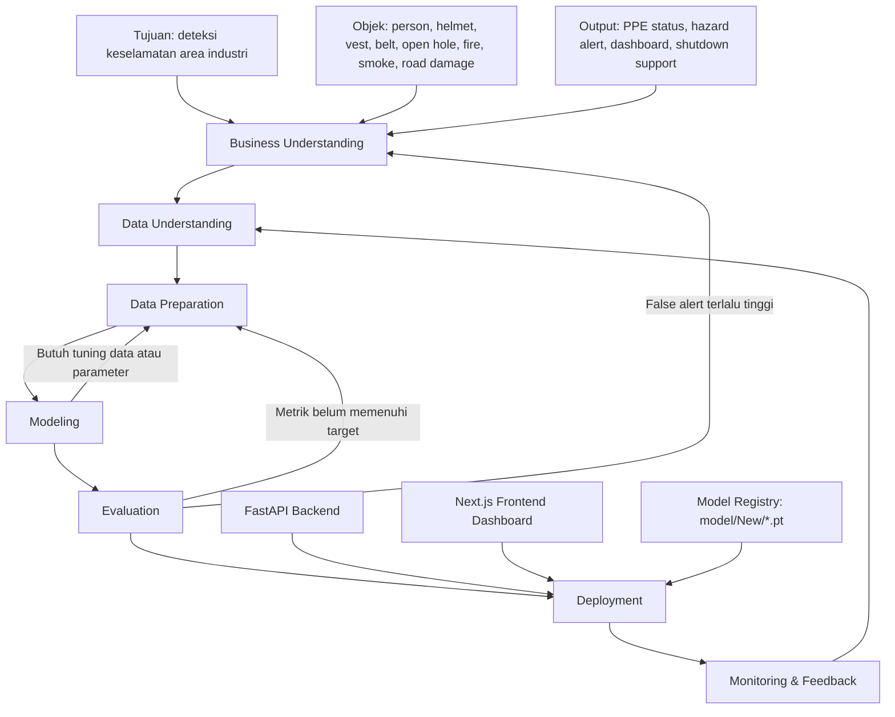
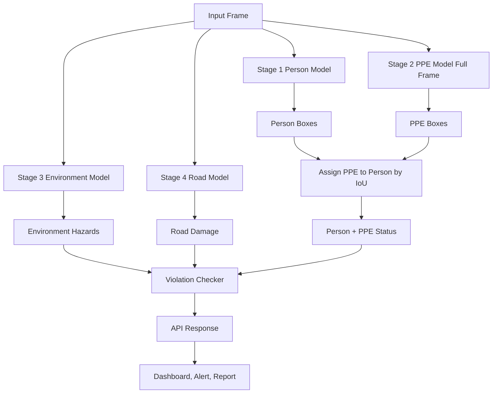
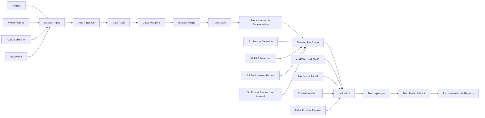
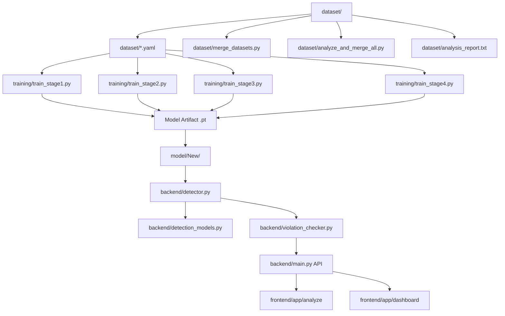
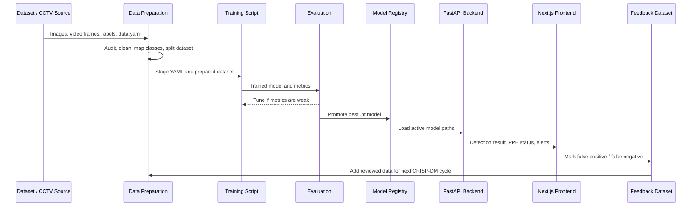

# SIEWS+ CRISP-DM Architecture Flow

Dokumen ini menjelaskan rancangan kerja CRISP-DM untuk pengembangan model computer vision SIEWS+.
Fokus utamanya adalah bagaimana kebutuhan bisnis keselamatan industri diterjemahkan menjadi dataset,
pipeline training, evaluasi model, deployment ke backend, dan siklus perbaikan berbasis feedback lapangan.

SIEWS+ memakai pendekatan multi-stage detection. Setiap stage dibuat fokus pada kelompok objek tertentu
agar proses evaluasi lebih jelas, threshold lebih mudah dikontrol, dan risiko false alert bisa dikurangi.

## 1. Tujuan Dokumen

Dokumen ini dipakai sebagai acuan untuk:

1. Menjelaskan hubungan CRISP-DM dengan arsitektur machine learning SIEWS+.
2. Menentukan input, proses, output, dan quality gate pada tiap fase.
3. Menyusun alur dataset dari sumber mentah sampai siap training.
4. Menjelaskan strategi model multi-stage: person, PPE, environment hazard, dan road/infrastructure hazard.
5. Menyambungkan hasil training ke backend FastAPI dan frontend dashboard.
6. Menentukan mekanisme monitoring serta feedback untuk retraining berikutnya.

## 2. Ringkasan CRISP-DM Dalam SIEWS+

CRISP-DM adalah kerangka kerja iteratif untuk proyek data science. Dalam SIEWS+, CRISP-DM tidak berhenti
pada training model, tetapi berputar terus dari data lapangan, evaluasi kesalahan, retraining, sampai model
yang lebih baik dipromosikan ke sistem produksi.

| Fase CRISP-DM | Makna Dalam SIEWS+ | Output Utama |
| --- | --- | --- |
| Business Understanding | Menentukan kebutuhan keselamatan, skenario bahaya, aturan alert, dan target model | Definisi use case, target class, aturan alert |
| Data Understanding | Memahami sumber gambar/video, kualitas label, distribusi class, dan kondisi lapangan | Laporan audit dataset dan risiko data |
| Data Preparation | Membersihkan label, mapping class, merge dataset, split train/val/test, augmentasi | Dataset YOLO siap training per stage |
| Modeling | Melatih model per stage dengan konfigurasi yang sesuai | Artifact `.pt`, training log, metrics awal |
| Evaluation | Menguji model dari sisi metrik dan dampak bisnis | Keputusan promote, tuning, atau retrain |
| Deployment | Memasang model terbaik ke backend dan dashboard | Model registry, API inference, UI result |
| Monitoring & Feedback | Mengumpulkan false positive/false negative untuk siklus berikutnya | Dataset feedback dan backlog perbaikan |

## 3. Flow Besar CRISP-DM



Inti flow di atas:

- Business requirement menentukan class dan aturan alert.
- Dataset dipahami dan disiapkan sebelum training.
- Model dilatih bertahap agar mudah dievaluasi.
- Hasil evaluasi menentukan apakah model layak deploy.
- Feedback lapangan masuk kembali menjadi data training berikutnya.

## 4. Konteks Bisnis SIEWS+

SIEWS+ dibuat untuk membantu pemantauan keselamatan di area industri migas atau konstruksi. Sistem menerima
gambar, video, atau stream kamera, lalu menghasilkan informasi keselamatan yang dapat dipakai operator.

### 4.1 Masalah Yang Ingin Diselesaikan

Masalah utama:

- Pekerja tidak menggunakan PPE lengkap.
- Area kerja memiliki bahaya visual seperti open hole, api, asap, atau kerusakan jalan.
- Operator membutuhkan alert cepat, tetapi tidak boleh terlalu sensitif.
- Dashboard harus menjelaskan alasan alert, bukan hanya memberi status bahaya.
- Hasil deteksi harus cukup stabil untuk mendukung workflow audit, laporan, dan tindakan lanjutan.

### 4.2 Target Output Sistem

Output yang diharapkan dari pipeline:

- Jumlah person terdeteksi.
- Bounding box setiap person.
- Status PPE per person:
  - `has_helmet`
  - `has_vest`
  - `has_belt`
  - confidence masing-masing PPE
  - daftar pelanggaran PPE
- Deteksi hazard lingkungan:
  - open hole
  - fire
  - smoke
  - safety cone atau barricade jika digunakan sebagai indikator area kerja
- Deteksi road/infrastructure hazard:
  - lubang jalan
  - retak
  - tambalan
  - objek infrastruktur lain sesuai dataset
- Summary untuk dashboard:
  - people found
  - hazard found
  - road damage found
  - violation count
  - camera or stream status

### 4.3 Aturan Bisnis Awal

Aturan bisnis diperlukan agar model detection tidak langsung berubah menjadi alert yang terlalu agresif.

| Kondisi | Keputusan Sistem |
| --- | --- |
| Person terdeteksi tanpa helmet | Buat PPE violation `NO HELMET` jika confidence helmet di bawah threshold |
| Person terdeteksi tanpa vest | Buat PPE violation `NO VEST` jika confidence vest di bawah threshold |
| Person terdeteksi tanpa belt | Buat PPE violation `NO BELT` jika belt tidak terdeteksi atau confidence tidak cukup |
| Hazard terdeteksi jauh dari person | Tampilkan hazard, tetapi tidak selalu menjadi pelanggaran person |
| Person masuk zona hazard | Buat hazard violation jika posisi person overlap atau masuk area hazard |
| Confidence rendah | Tahan alert kritis, tampilkan sebagai low-confidence detection atau butuh review |
| Deteksi berulang dalam stream | Gunakan cooldown/tracking agar alert tidak spam |

## 5. Arsitektur Multi-Stage Model

Pendekatan multi-stage memisahkan model berdasarkan tanggung jawab. Tujuannya agar setiap model fokus,
lebih mudah dituning, dan tidak semua class bercampur dalam satu model besar.

### 5.1 Stage Model

| Stage | Fokus | Contoh Model/YAML | Keterangan |
| --- | --- | --- | --- |
| Stage 1 | Person detection | `yolo26n.pt` atau `yolov8n.pt`, `dataset/stage1_person.yaml` | Mendeteksi manusia dari full frame |
| Stage 2 | PPE detection | `model/New/best_stage2_labeled_safety.pt`, `dataset/stage2_ppe_harness.yaml` | Mendeteksi helmet, vest, belt/harness, dan class PPE pendukung |
| Stage 3 | Environment hazard | `model/New/best_stage3_openhole.pt`, `dataset/stage3_environment.yaml` atau dataset open hole aktif | Mendeteksi hazard lingkungan seperti open hole, fire, smoke, barricade, cone |
| Stage 4 | Road/infrastructure hazard | `model/New/best_jalan_berlubang.pt`, `dataset/stage4_infrastructure.yaml` | Mendeteksi lubang jalan, retak, tambalan, dan objek infrastruktur |

Catatan penting:

- File `dataset/stage3_environment.yaml` di repo mendefinisikan class `fire` dan `smoke`.
- Backend saat ini memuat `model/New/best_stage3_openhole.pt` sebagai environment model.
- `dataset/stage4_infrastructure.yaml` memuat class infrastruktur, termasuk `open_hole`.
- `model/New/best_jalan_berlubang.pt` dipakai backend sebagai model road damage.
- Karena ada beberapa eksperimen dataset, dokumen ini membedakan konsep stage dari artifact model aktif.

### 5.2 Flow Inference Multi-Stage



Alur ini mengikuti pola backend:

1. Model person mencari pekerja pada frame.
2. Model PPE dijalankan pada full frame, bukan crop person, agar distribusi input sama dengan training.
3. Hasil PPE dipasangkan ke person menggunakan IoU.
4. Model environment dan road berjalan pada full frame.
5. Violation checker mengubah detection menjadi status keselamatan.
6. API mengirim hasil ke frontend untuk visualisasi dan audit.

## 6. Flow Dataset Sampai Training



## 7. Detail Fase CRISP-DM

### 7.1 Business Understanding

Fase ini menentukan kebutuhan sistem sebelum dataset diproses.

Pertanyaan utama:

- Area kerja mana yang menjadi target pemantauan?
- Objek keselamatan apa saja yang wajib dideteksi?
- PPE apa saja yang dianggap mandatory?
- Deteksi apa yang hanya informasi, dan deteksi apa yang harus menjadi alert?
- Seberapa sensitif alert boleh berjalan?
- Apakah sistem hanya memberi peringatan, membuat laporan, atau mendukung shutdown logic?

Keputusan yang harus dibuat:

- Final class per stage.
- Minimum confidence per kelompok object.
- Aturan PPE violation.
- Aturan hazard violation.
- Format output API yang dibutuhkan dashboard.
- Risiko bisnis dari false positive dan false negative.

Output fase:

- Daftar use case.
- Daftar class final.
- Definisi violation.
- Target metrik awal.
- Prioritas risiko.

Quality gate:

- Semua class punya definisi operasional yang jelas.
- Tidak ada class ambigu, misalnya `hole`, `open_hole`, dan `road_hole` tanpa pemisahan makna.
- Alert tidak hanya berdasarkan confidence model, tetapi juga aturan bisnis.

### 7.2 Data Understanding

Fase ini mengecek kualitas dataset sebelum data digabung atau dilatih.

Hal yang diperiksa:

- Sumber data:
  - CCTV industri.
  - Foto lapangan.
  - Frame video.
  - Roboflow export.
  - Dataset publik.
- Format label YOLO:
  - `class_id x_center y_center width height`.
  - Nilai koordinat harus berada pada rentang 0 sampai 1.
  - Setiap label harus punya pasangan file gambar.
- Kesesuaian `data.yaml`:
  - `nc` sesuai jumlah class.
  - `names` sesuai class id pada label.
  - path `train`, `val`, dan `test` benar.
- Distribusi class:
  - Jumlah instance per class.
  - Ketimpangan class.
  - Class yang terlalu sedikit.
- Kualitas gambar:
  - buram.
  - gelap.
  - terlalu jauh.
  - angle ekstrem.
  - objek terlalu kecil.
  - occlusion.
  - glare atau backlight.

Output fase:

- Laporan audit dataset.
- Daftar dataset yang layak dipakai.
- Daftar dataset yang harus diperbaiki atau dikeluarkan.
- Risiko bias data, misalnya hanya siang hari atau hanya angle tertentu.

Quality gate:

- Label dapat dibaca oleh YOLO.
- Tidak ada class id di label yang melebihi `nc - 1`.
- Tidak ada split train/val/test yang overlap.
- Minimal ada sample visual untuk memverifikasi mapping class.

### 7.3 Data Preparation

Fase ini adalah bagian paling penting untuk menaikkan kualitas model. Model yang bagus biasanya dimulai dari
dataset yang bersih, bukan hanya dari epoch training yang panjang.

Aktivitas utama:

- Normalisasi nama class:
  - `hardhat`, `hard_hat`, `helmet` menjadi `helmet`.
  - `safety-vest`, `hi-vis`, `vest` menjadi `safety_vest` atau `vest` sesuai target.
  - `pothole`, `lubang`, `road_hole` menjadi class road yang konsisten.
- Remapping class id:
  - Mapping class sumber ke class target per stage.
  - Menghapus class yang tidak dipakai.
  - Menjaga urutan class sesuai YAML stage.
- Merge dataset:
  - Menggabungkan dataset relevan.
  - Memberi nama file unik agar tidak bentrok.
  - Menjaga pasangan image-label.
- Split dataset:
  - `train` untuk training.
  - `val` untuk validasi selama training.
  - `test` untuk evaluasi akhir.
- Validasi label:
  - file label kosong.
  - bbox di luar rentang.
  - bbox terlalu kecil.
  - class id tidak valid.
  - gambar tanpa label.
  - label tanpa gambar.
- Augmentasi:
  - brightness dan contrast untuk kondisi CCTV.
  - blur ringan untuk gerakan atau kamera jauh.
  - scale dan crop untuk variasi ukuran objek.
  - perspective untuk sudut kamera tinggi.
  - mosaic/mixup sesuai kebutuhan training YOLO.

Output fase:

- Dataset stage dalam format YOLO.
- YAML final per stage.
- Statistik jumlah image, label, dan instance.
- Catatan mapping class.

Quality gate:

- Dataset dapat diload oleh training script.
- Split tidak bocor.
- Minimal beberapa sample divisualisasikan dengan bounding box dan nama class.
- Class kritikal punya jumlah instance memadai.

### 7.4 Modeling

Training dibuat bertahap agar model lebih fokus dan mudah dievaluasi.

#### Stage 1: Person Detection

Tujuan:

- Mendeteksi manusia/pekerja pada full frame.
- Menjadi anchor untuk assignment PPE.

Input:

- Full frame dari kamera, gambar upload, atau video.
- Model dasar COCO seperti `yolov8n.pt` atau `yolo26n.pt`.

Output:

- Bounding box person.
- Confidence person.
- Center dan bottom center untuk kebutuhan zone atau hazard checking.

Catatan:

- COCO sudah memiliki class `person`.
- Fine-tuning hanya diperlukan jika footage lapangan berbeda jauh dari data umum, misalnya kamera thermal, low-light ekstrem, atau angle CCTV sangat tinggi.

#### Stage 2: PPE Detection

Tujuan:

- Mendeteksi PPE pekerja seperti helmet, vest, dan belt/harness.
- Menghasilkan status PPE per person.

Input:

- Full frame.
- Person boxes dari Stage 1.

Output:

- PPE boxes.
- Assignment PPE ke person menggunakan IoU.
- Status:
  - `has_helmet`
  - `has_vest`
  - `has_belt`
  - `helmet_conf`
  - `vest_conf`
  - `belt_conf`
  - `ppe_violations`

Catatan:

- Backend saat ini menjalankan PPE pada full frame, lalu memasangkan ke person.
- Ini penting karena model PPE dilatih pada konteks full image. Crop person bisa mengubah distribusi input dan menurunkan performa.

#### Stage 3: Environment Hazard Detection

Tujuan:

- Mendeteksi hazard lingkungan dari full frame.
- Contoh class: fire, smoke, open hole, barricade, safety cone, atau hazard area lain sesuai dataset aktif.

Input:

- Full frame.

Output:

- Bounding box hazard.
- Class hazard.
- Confidence hazard.

Catatan:

- File YAML stage 3 di repo berisi `fire` dan `smoke`.
- Model aktif backend memakai `best_stage3_openhole.pt`, sehingga evaluasi harus memastikan class aktual model sesuai mapping backend.

#### Stage 4: Road/Infrastructure Hazard Detection

Tujuan:

- Mendeteksi bahaya infrastruktur atau jalan.
- Contoh class: lubang jalan, retak, tambalan, open hole, oil tank, truck, equipment, pressure gauge, dan objek infrastruktur lain sesuai YAML.

Input:

- Full frame.

Output:

- Road damage detections.
- Infrastructure detections.
- Confidence per object.

Catatan:

- Backend saat ini memuat `best_jalan_berlubang.pt` untuk road damage.
- YAML `stage4_infrastructure.yaml` juga mendukung class infrastruktur lebih luas.

### 7.5 Evaluation

Model tidak cukup hanya dilihat dari confidence. Evaluasi harus menggabungkan metrik ML dan dampak bisnis.

Metrik teknis:

- `mAP50`: kualitas deteksi pada IoU 0.50.
- `mAP50-95`: kualitas deteksi pada rentang IoU yang lebih ketat.
- Precision: seberapa banyak prediksi yang benar.
- Recall: seberapa banyak objek aktual yang berhasil ditemukan.
- Confusion matrix: class mana yang sering tertukar.
- PR curve: hubungan threshold dengan precision/recall.

Metrik bisnis:

- Jumlah false alert per jam kamera.
- Jumlah missed hazard.
- Jumlah PPE violation yang benar.
- Stabilitas alert pada video stream.
- Waktu inference per frame.
- Beban CPU/GPU.

Evaluasi per stage:

| Stage | Risiko Utama | Fokus Evaluasi |
| --- | --- | --- |
| Person | Person tidak terdeteksi | Recall person, performa pada crowd dan occlusion |
| PPE | PPE kecil atau tertutup | Precision untuk alert, recall untuk pelanggaran |
| Environment | Hazard terlihat mirip background | False positive pada area kerja normal |
| Road/Infrastructure | Class mirip dan variasi bentuk besar | Confusion matrix dan sample lapangan |

Quality gate sebelum promote:

- Model berhasil infer pada sample gambar/video lapangan.
- Tidak ada class mapping yang salah antara model dan backend.
- Threshold awal sudah ditentukan per model.
- False positive/false negative direview secara visual.
- Artifact model disimpan dengan nama yang jelas.
- Model lama tetap tersedia sebagai rollback.

### 7.6 Deployment

Deployment berarti model terbaik dipasang ke sistem agar bisa dipakai backend dan frontend.

Komponen deployment:

- Model registry:
  - `model/New/*.pt` untuk model aktif atau kandidat baru.
  - `model/Old/*.pt` untuk model lama atau rollback.
- Backend:
  - `backend/detector.py` memuat model multi-stage.
  - `backend/detection_models.py` menyimpan class helper, threshold, dan dataclass result.
  - `backend/violation_checker.py` mengubah detection menjadi violation.
  - `backend/main.py` menyediakan API untuk upload, stream, dashboard, dan report.
- Frontend:
  - Dashboard menampilkan detection result.
  - Halaman analyze menampilkan hasil gambar/video.
  - Alert dan report membaca response backend.

Output deployment:

- API inference berjalan.
- Hasil detection tampil di dashboard.
- Alert punya alasan yang jelas.
- Model dapat diganti tanpa mengubah seluruh aplikasi.

Quality gate:

- Backend berhasil load semua model.
- API mengembalikan schema yang stabil.
- Frontend tidak rusak ketika ada hasil kosong.
- Latency masih sesuai target.
- Ada fallback jika model file tidak ditemukan.

### 7.7 Monitoring & Feedback

Setelah model dipakai, hasil lapangan harus kembali menjadi dataset baru. Ini bagian yang membuat CRISP-DM
bersifat iteratif.

Data feedback yang perlu dikumpulkan:

- False positive:
  - PPE dianggap hilang padahal ada.
  - Hazard terdeteksi padahal bukan bahaya.
  - Jalan normal dianggap berlubang.
- False negative:
  - Person tidak terdeteksi.
  - Helmet/vest/belt tidak terdeteksi padahal terlihat.
  - Open hole, fire, smoke, atau lubang jalan terlewat.
- Ambiguous case:
  - Objek terlalu jauh.
  - Gambar terlalu gelap.
  - PPE tertutup sebagian.
  - Refleksi atau shadow menyerupai hazard.

Siklus feedback:

1. Simpan frame atau gambar bermasalah.
2. Tandai jenis kesalahan.
3. Relabel data dengan class mapping terbaru.
4. Tambahkan ke dataset stage yang sesuai.
5. Retrain model.
6. Bandingkan metrik model lama dan baru.
7. Promote hanya jika model baru lebih baik atau memperbaiki risiko penting.

## 8. Mapping Dengan Struktur Repo Saat Ini



### 8.1 Dataset Dan YAML

| File | Fungsi |
| --- | --- |
| `dataset/stage1_person.yaml` | Konfigurasi dataset person detection |
| `dataset/stage2_ppe_harness.yaml` | Konfigurasi dataset PPE dan harness |
| `dataset/stage3_environment.yaml` | Konfigurasi dataset environment hazard, saat ini `fire` dan `smoke` |
| `dataset/stage4_infrastructure.yaml` | Konfigurasi dataset infrastructure, termasuk `open_hole` |
| `dataset/merge_datasets.py` | Script merge dataset |
| `dataset/analyze_and_merge_all.py` | Script analisis dan merge lebih lengkap |
| `dataset/analysis_report.txt` | Catatan hasil analisis dataset |

### 8.2 Training Script

| File | Fungsi |
| --- | --- |
| `training/train_stage1.py` | Person detection atau fine-tuning person jika dibutuhkan |
| `training/train_stage2.py` | Training PPE dan safety harness |
| `training/train_stage3.py` | Training fire/smoke environment model |
| `training/train_stage4.py` | Training infrastructure, vehicle, dan equipment model |
| `training/*.ipynb` | Notebook eksperimen dataset khusus seperti PPE, open hole, rust, atau jalan berlubang |

### 8.3 Model Artifact

| Direktori/File | Fungsi |
| --- | --- |
| `model/New/best_stage2_labeled_safety.pt` | Model PPE aktif/kandidat aktif |
| `model/New/best_stage3_openhole.pt` | Model environment/open hole aktif |
| `model/New/best_jalan_berlubang.pt` | Model road damage aktif |
| `model/Old/*.pt` | Model lama untuk referensi atau rollback |

### 8.4 Backend Inference

| File | Fungsi |
| --- | --- |
| `backend/detector.py` | Loader model dan pipeline inference multi-stage |
| `backend/detection_models.py` | Definisi class, threshold, dataclass, helper violation |
| `backend/violation_checker.py` | Rule untuk PPE violation dan hazard violation |
| `backend/drawing.py` | Visualisasi bounding box dan status pada frame |
| `backend/video_processor.py` | Proses video offline |
| `backend/stream.py` | Proses stream kamera |
| `backend/main.py` | API utama untuk frontend |

## 9. Kontrak Data Antar Komponen

Kontrak data diperlukan agar backend, frontend, dan model tidak berjalan dengan asumsi berbeda.

### 9.1 Input Dataset YOLO

Struktur umum:

```text
dataset/stageX/
  train/
    images/
    labels/
  val/
    images/
    labels/
  test/
    images/
    labels/
```

Format label:

```text
class_id x_center y_center width height
```

Contoh:

```text
0 0.5123 0.4330 0.2100 0.3800
```

Aturan:

- `class_id` harus integer.
- Koordinat bbox harus normalized.
- Setiap nilai bbox harus berada di rentang 0 sampai 1.
- Satu baris label mewakili satu object.
- File label kosong berarti gambar tidak punya object yang dilabeli.

### 9.2 Output Backend

Output inference idealnya memuat:

```json
{
  "persons": [
    {
      "bbox": [10, 20, 120, 300],
      "confidence": 0.91,
      "ppe_result": {
        "has_helmet": true,
        "has_vest": false,
        "has_belt": true,
        "helmet_conf": 0.86,
        "vest_conf": 0.0,
        "belt_conf": 0.74,
        "raw_labels": ["helmet(86%)", "belt(74%)"]
      },
      "ppe_violations": ["NO VEST"]
    }
  ],
  "env": [
    {
      "bbox": [300, 210, 420, 360],
      "label": "open_hole",
      "class_name": "open_hole",
      "confidence": 0.78
    }
  ],
  "road": [
    {
      "bbox": [40, 400, 180, 470],
      "label": "lubang",
      "class_name": "lubang",
      "confidence": 0.81
    }
  ],
  "safety_cones": []
}
```

Frontend sebaiknya tidak menebak sendiri status keselamatan. Frontend cukup membaca hasil backend:

- bounding box.
- class name.
- confidence.
- PPE status.
- violation list.
- summary.

## 10. Quality Gate Per Fase

| Fase | Gate Minimum | Risiko Jika Dilewati |
| --- | --- | --- |
| Business Understanding | Class dan aturan alert sudah jelas | Model bagus secara metrik tetapi salah secara kebutuhan |
| Data Understanding | Dataset diaudit dan class mapping dipahami | Label salah masuk training |
| Data Preparation | Split bersih, label valid, YAML benar | Training error atau metrik menipu |
| Modeling | Konfigurasi training tercatat | Model sulit direproduksi |
| Evaluation | Metrik dan sample lapangan direview | False alert tinggi saat produksi |
| Deployment | Backend load model dan API stabil | Aplikasi gagal inference |
| Monitoring | Kesalahan lapangan dikumpulkan | Model tidak membaik dari waktu ke waktu |

## 11. Rekomendasi Threshold Awal

Threshold perlu dituning dari hasil evaluasi, tetapi baseline awal bisa dibuat seperti berikut.

| Kelompok | Threshold Awal | Alasan |
| --- | --- | --- |
| Person | 0.50 | Mengurangi person palsu, tetap cukup sensitif untuk pekerja |
| PPE | 0.35 | PPE sering kecil atau tertutup, threshold terlalu tinggi bisa memicu false violation |
| Environment hazard | 0.40 | Hazard perlu cukup yakin sebelum menjadi alert |
| Road damage | 0.40 | Lubang/retak sering bervariasi bentuk dan tekstur |
| Safety cone | 0.50 | Cone bisa mirip objek kecil lain, perlu threshold lebih ketat |

Threshold final harus ditentukan dari:

- validation metrics.
- sample lapangan.
- jumlah false alert.
- dampak risiko jika object terlewat.
- performa per kamera.

## 12. Strategi Evaluasi Lapangan

Evaluasi lapangan perlu dibuat terpisah dari validation set agar hasil tidak terlalu optimis.

Dataset evaluasi lapangan sebaiknya mencakup:

- Siang hari.
- Malam hari.
- Area indoor.
- Area outdoor.
- Kamera statis.
- Kamera dengan angle tinggi.
- Pekerja dekat kamera.
- Pekerja jauh dari kamera.
- PPE lengkap.
- PPE tidak lengkap.
- Hazard dekat person.
- Hazard jauh dari person.
- Jalan normal dan jalan rusak.

Checklist review visual:

- Apakah bounding box person stabil?
- Apakah PPE salah assign ke person lain?
- Apakah helmet/vest/belt kecil masih terdeteksi?
- Apakah hazard palsu muncul dari shadow, tanah, atau tekstur jalan?
- Apakah model road membedakan lubang, retak, dan tambalan?
- Apakah confidence terlalu rendah untuk object yang jelas?
- Apakah alert muncul berulang pada frame yang sama?

## 13. Model Promotion Dan Versioning

Model tidak boleh langsung menggantikan model aktif hanya karena training selesai. Perlu proses promotion.

### 13.1 Naming Artifact

Format yang disarankan:

```text
best_<stage>_<domain>_<date>_<metric>.pt
```

Contoh:

```text
best_stage2_ppe_20260504_map50-82.pt
best_stage3_openhole_20260504_map50-78.pt
best_stage4_road_20260504_map50-80.pt
```

Untuk model aktif yang dipakai backend, nama dapat dibuat stabil:

```text
model/New/best_stage2_labeled_safety.pt
model/New/best_stage3_openhole.pt
model/New/best_jalan_berlubang.pt
```

Catatan versi detail bisa disimpan di changelog atau manifest.

### 13.2 Model Manifest Yang Disarankan

Tambahkan manifest jika pipeline mulai sering berubah:

```json
{
  "stage2": {
    "path": "model/New/best_stage2_labeled_safety.pt",
    "classes": ["unknown", "belt", "helmet", "vest"],
    "threshold": 0.35,
    "trained_at": "2026-05-04",
    "dataset": "labeled_safety"
  },
  "stage3": {
    "path": "model/New/best_stage3_openhole.pt",
    "classes": ["barricade", "hard_hat", "safety_cone", "open_hole", "vest"],
    "threshold": 0.40,
    "trained_at": "2026-05-04",
    "dataset": "openhole_environment"
  },
  "road": {
    "path": "model/New/best_jalan_berlubang.pt",
    "classes": ["lubang", "retak", "tambalan"],
    "threshold": 0.40,
    "trained_at": "2026-05-04",
    "dataset": "jalan_berlubang"
  }
}
```

Manfaat manifest:

- Backend tidak hardcode terlalu banyak path.
- Class mapping lebih mudah diaudit.
- Rollback lebih aman.
- Evaluasi model bisa dilacak.

## 14. Risiko Dan Mitigasi

| Risiko | Dampak | Mitigasi |
| --- | --- | --- |
| Class mapping berbeda antara YAML dan backend | Label output salah | Simpan manifest class model dan validasi saat load |
| Dataset terlalu tidak seimbang | Class minor sering gagal terdeteksi | Tambah data class minor atau gunakan sampling/augmentation |
| PPE kecil dan tertutup | False violation | Gunakan resolusi cukup, threshold PPE khusus, sample lapangan |
| False alert hazard tinggi | Operator mengabaikan alert | Tambah rule bisnis, cooldown, zone logic, review FP |
| Model lambat di stream | FPS rendah | Pilih model lebih kecil, batching, frame skipping, GPU |
| Data leakage train/val | Metrik terlalu bagus | Cek overlap filename/hash antar split |
| Model baru lebih buruk pada kamera tertentu | Regression produksi | Test per kamera dan simpan model rollback |

## 15. Rekomendasi Flow Implementasi

1. Tetapkan class final per stage dan pastikan sesuai kebutuhan bisnis.
2. Audit semua `data.yaml` dan label YOLO.
3. Pastikan class mapping di dataset, model, dan backend konsisten.
4. Jalankan analisis dataset dengan `dataset/analyze_and_merge_all.py`.
5. Jalankan merge dataset sesuai stage.
6. Visualisasikan sample label untuk memastikan nama class benar.
7. Train model per stage dengan script di `training/`.
8. Evaluasi menggunakan mAP, precision, recall, confusion matrix, dan sample lapangan.
9. Tentukan threshold per model.
10. Simpan model terbaik ke `model/New/`.
11. Simpan model lama ke `model/Old/` sebagai rollback.
12. Pastikan backend dapat load model dan menghasilkan response stabil.
13. Uji frontend untuk hasil kosong, hasil banyak object, dan hasil violation.
14. Kumpulkan false positive dan false negative dari dashboard.
15. Masukkan feedback ke dataset retraining berikutnya.

## 16. Checklist Sebelum Training

- [ ] Dataset sudah diekstrak.
- [ ] Struktur `train/val/test` tersedia.
- [ ] Folder `images` dan `labels` lengkap.
- [ ] File `data.yaml` benar.
- [ ] `nc` sesuai jumlah `names`.
- [ ] Class id label tidak melebihi `nc - 1`.
- [ ] Tidak ada label rusak.
- [ ] Tidak ada bbox di luar rentang 0 sampai 1.
- [ ] Tidak ada overlap train/val/test.
- [ ] Mapping class sudah direview.
- [ ] Sample bounding box sudah divisualisasikan.
- [ ] Class kritikal punya data cukup.

## 17. Checklist Sebelum Deployment

- [ ] Model bisa diload dengan Ultralytics YOLO.
- [ ] `model.names` sesuai ekspektasi backend.
- [ ] Threshold awal sudah ditentukan.
- [ ] Inference sample gambar berhasil.
- [ ] Inference sample video berhasil.
- [ ] API mengembalikan `persons`, `env`, `road`, dan `safety_cones`.
- [ ] PPE assignment ke person masuk akal.
- [ ] Violation checker menghasilkan output benar.
- [ ] Frontend dapat menampilkan bounding box dan summary.
- [ ] Model lama tersedia untuk rollback.

## 18. Ringkasan Alur Teknis



## 19. Kesimpulan

CRISP-DM untuk SIEWS+ adalah siklus kerja dari kebutuhan keselamatan sampai model produksi. Nilai utamanya
bukan hanya training YOLO, tetapi menjaga agar data, class mapping, evaluasi, backend, frontend, dan feedback
lapangan tetap konsisten.

Dengan pendekatan multi-stage, SIEWS+ dapat:

- Memisahkan tanggung jawab model.
- Menentukan threshold berbeda untuk person, PPE, environment, dan road hazard.
- Mengevaluasi error dengan lebih spesifik.
- Mengurangi risiko false alert.
- Memperbaiki model secara bertahap dari feedback lapangan.

Dokumen ini sebaiknya diperbarui setiap kali ada perubahan class, dataset, model artifact, threshold, atau
aturan violation di backend.
